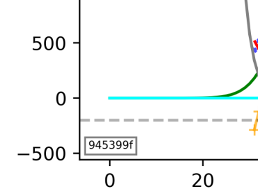

# Why do I want to sneaky-plot-tag?

reproduciblity! It's important - or so I'm told. But - it takes dicipline. 

an unobtrusive little 

This is the bare minimum solution. However, I've found it to work great - git UIs typically allow you to do searches by short hash, even if you don't know the repo.

you can forget to put it in the title or obliterate it 

What code made this plot?

steganography

Maybe you see some weird glitch and you Slack message the plot to someone else, or you copy it into your lab notebook. You committed the code that generated it, because that only takes a few seconds. but then over time that code was scrapped and switch to something else and that specific analysis gets buried in the git repo. Oh, and the filename got obliterated to `download (57).jpg`, so there's no tracing that.

It's actually non-trivial to retain the correspondence between the !

Some possible strategies:

- Turn every plot into an artifact. Have your organization host some kind of handle server, or push to Zenodo before sharing anything, even internally. Never share the plot itself, only DOIs.
    - This is a great idea
- Use a reproducibility tool like Sumatra

Downsides:

- If you're using interactive plotting (.show) and you change the zoom, will the box disappear? 

Most vendors electron micrograph. (sometimes called the `Data Zone`) as a fallback - just in case the custodian finds a printout Shectman's 5-fold diffraction pattern on the floor of the records, devoid of any context.

lab notebook

The best advice I've heard is to treat data science pipelines like production software; using the same tools to formally "cut a release", using established CI/CD to package the outputs and the code together.

